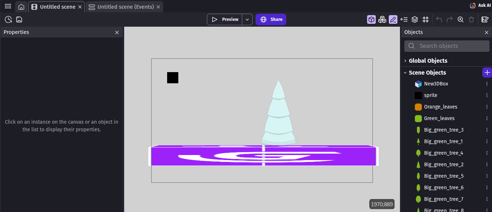

# Entry 1
##### 11/5/25

### Content
The tool that I decided on was [gDevelop](https://gdevelop.io/) because it's a very **versatile** tool that can be used to make all kinds of games.  
I tinkered with [gDevelop](https://gdevelop.io/) by making a small game using what I learned from the [tutorials](https://editor.gdevelop.io/) the tool gave.  
So far, I've learned how to:  
* Add behaviors to objects.
* Add objects.
* Change the behavior of the **camera**.
* Add backgrounds.
* Make conditionals in the **events** section.
* Add **movement** to the character.
* Add **bullets**.
* Add a **timer**.
* Use _Javascript_ in the **events** page.
  
The home page of my mini-project:  

The events page:  
.png)
### EDP

### Skills

####

####

[Next](entry02.md)

[Home](../README.md)
