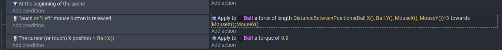

# Entry 2
##### 12/18/25

### Content
After the previous entry, I've been _trying new events within the events page_ and using _videos_ to learn how to create movement.  
So far, I've learned how to _create and use text with **variables**_ and I made a _basic movement system_ that **could be used** for my game.  
To add text in [gDevelop](https://editor.gdevelop.io/), you have to _change the value_ of the variable via javascript or making it an action in the events page. _Every time_ the text changes, you have to **update** it.  
I learned how to use text in [gDevelop](https://editor.gdevelop.io/) by reading through [this post](https://forum.gdevelop.io/t/using-a-text-object-to-display-a-variable/27967/3).  
An example of using text:  

I also learned how to make the player move **using the mouse without allowing them to drag the player across the level**.  
I learned this in [this tutorial](https://www.youtube.com/watch?v=D2k1Lkld6fk).  
The basic code is as follows:  

My FP goal for the winter break is to, hopefully, have enough time to **finish** the movement tutorial and **experiment** with it,
while also finishing the work from other classes so that I can dedicate the rest of my lunch periods (in this semester) to learning this tool.
### EDP
I am currently at the second step of the _Engineering Design Process_, which is to **research the problem**. I've already learned many things about how to use [gDevelop](https://editor.gdevelop.io/) to create a properly functioning game, but I'm still **unable** to make the game that I vision. I also have to learn how to use javascript to help me make my game, since currently, the most I can do with it is to change the position of the player and what the text is displaying.  
Most likely, I will still be on the second step of the **EDP** since I still haven't finished researching my tool.
### Skills
Two skills that I've developed since the previous entry are **how to learn** and **embracing failure**.
#### How to Learn
Learning my _Freedom Project Tool_ involves a lot of **experimentation**; even if I found the right tutorials, I have to **commit it to memory** so that I can do it again without having my learning log in the next tab. Many of the things that I've learned about using [gDevelop](https://editor.gdevelop.io/) was learned through using actions and conditions that I found in the events page accidentally. I never actually learned about what these actions and conditions did, but using the brief summary at the top of each when I clicked them, I tried to make them work. This allows me to find things that I can use to solve a problem I have because I already experimented with many of the events besides joints.
#### Embracing Failure
In the process of experimentating with each action and condition, I inevitably met many **failures**. One of the most prominent ones was using the **collision condition**. When I tried using that condition, the only one that worked was using the an impulse to apply a force to an object. The others didn't seem to work. Another failure that I faced was that when I attempted to learn how to use **joints**, for some reason, when I tried a delete a revolute joint via an action, it just never got deleted, it just stayed there. Instead of feeling bad about the failure, I just moved on after I comfirmed that I didn't know how to use the joint. I reasoned that I probably **didn't need** to learn how to use the joint, it would just be going above and beyond. I just needed to find a way to implement the main systems I **needed** for my game to work.

[Previous](entry01.md) | [Next](entry03.md)

[Home](../README.md)
