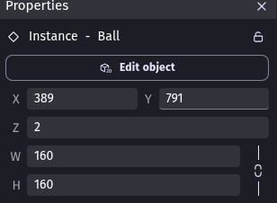
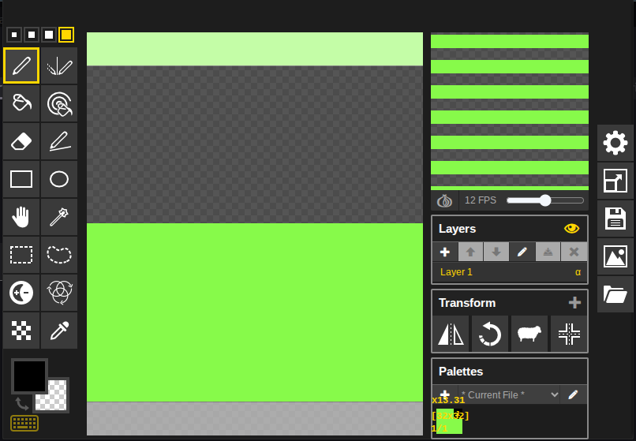
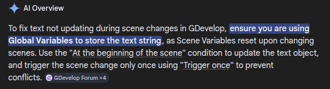

# Entry 4
##### 3/9/26
### Content
Since the previous entry, I've been trying out different methods to make the aiming system smoother, as constantly adjusting the multipliers for the `Aim` object makes the white line move in an unnatural way.  
I found out that I can just find and edit the height and width of the `Ball` object in the properties tab:  

  

This allows me to move the sequence of events that constantly adjusted the multiplyer for the `Aim` object, while still keeping the accuracy relatively the same.  

I also found out how to change the textures of my objects so that it wouldn't just be a default purple box for everything in the game. So far, I only did this with the obstacles and the floor:  

Finally, I fixed the issue where the text stating what level the player is on didn't change when the scene changed from the first one to the second one.  
I found out how to do this by just searching up and using what the A.I. provided me:

### EDP

### Skills
#### 
####

[Previous](entry03.md) | [Next](entry05.md)

[Home](../README.md)
