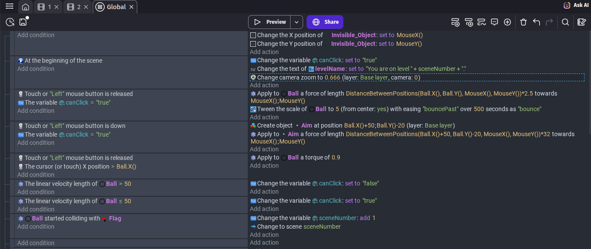
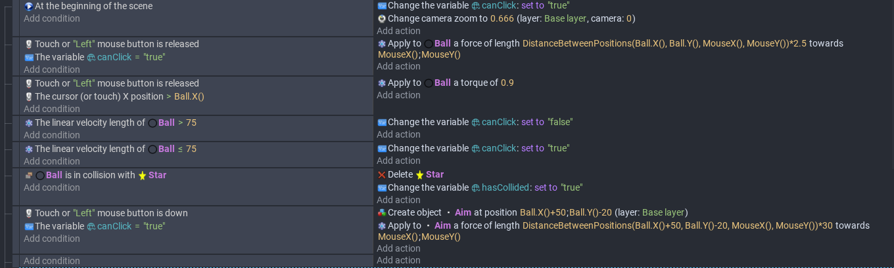
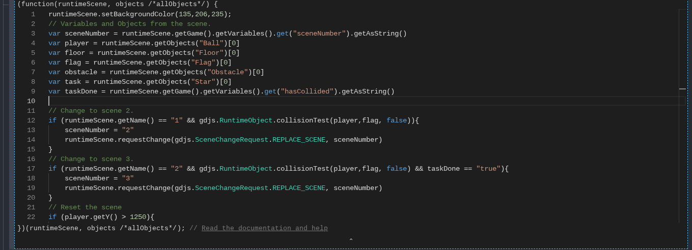

# Entry 5
##### 4/13/26

### Content
After finishing entry 4, I've been working on learning how to implement javascript into my game.  
I have managed to find [a documentation](https://docs.gdevelop.io/GDJS%20Runtime%20Documentation/) for this and have been learning about how to convert the code I had previously into javascript.  
I've also added an additional task in level 2.

Before the change (no javascript and no task in level 2):  

After the change (code blocks and javascript are separated):  

### EDP

### Skills
####
####

[Previous](entry04.md) | [Next](entry06.md)

[Home](../README.md)
