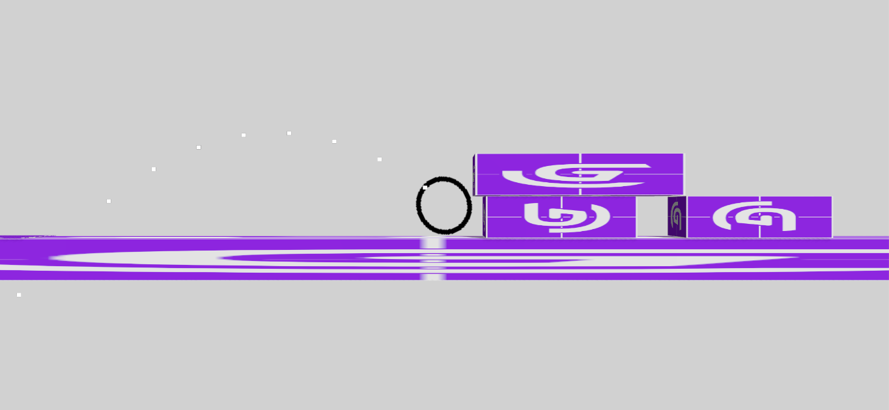
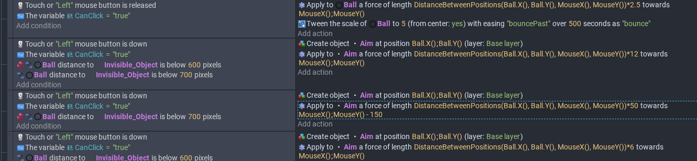

# Tool Learning Log

## Tool: **gDevelop**

## Project: **Ball (platformer?)**
---

### 9/29/25:
https://editor.gdevelop.io/ (Must use this or download)

##### Adding behaviors to objects (player and enemies)
Right side of screen, click on 3 dots or right click (doesn't work sometimes)
Behaviors tab > edit behaviors
Platformer character = add movement (can change all settings on speed/gravity, etc)
* Jump height is "Jump Speed"
* To make a "platform" solid, add the behavior of "platform".)

### 10/1/25:
* Smooth Camera (in behaviors)
 * Makes the camera follow the character (uncheck y-axis to make it not follow veritcally) x-axis is horrizontal
* Layouts panel (top right, 3 pieces of paper stacked on top of each other.)
 * Can be used to add a background(s) (can be resized)
 * Also shows how much the camera can view with the black outline
  * Backgrounds can be stacked ontop of each other
* CameraScene(events)
 * Changes things in relation to the scene itself.
  * For making backgrounds move:
   * Select the background object > scroll down until image X Offset
   * The value is used to move the background relative to the position of the camera.
   * By making it slower than the camera, it gives an effect of depth.
   * What to put into "value": `CameraCenterX()/8`
   * Decreasing the number at the end makes it move faster (closer to the player)
* The Far-ground should move slower than the mid-ground and etc.
### 10/3/25:
* Top-down movement (behaviors)
  * Another way to add movement (Not platformer games
* Pixel-perfect (behaviors)
  * Changes movement to match the pixels on the screen (for pixel-perfect games)
### 10/9/25:
* Joystick controls (mobile):
Interface layer (bottom) > add objects (right) > scroll down until Prefabs > select joysticks  > drag it onto the scene > edit behaviors on object(s) you want the joystick to control > add the ‘top down multi-touch controller mapper’ behavior
* Displaying a health bar using prefabs:
Interface > add objects > prefabs > resources bar > choose health bar > drag onto screen levels(events) [top left] > add action > select health bar > scroll down to value > click the blue 123 use health points > select player

### 10/28/25:
* After logging into my account, my progress on the tutorials was deleted due to not pressing the tiny save button (top left)
* Created a sprite and made it stand on a platform and changed the length of the platform.
* Added a simple conditonal to the game that if the sprite was on the platform, the x-position of the object increases by 2.
  * Doesn't seem to work with gravity and it appears to be on a scale of 0-10.
    * You can make it one-time activation or make it activate multiple times.
* In the events section, right click one of the boxes and click the javascript option so that you can add javascript to your game.
* I added a loop so that if the x-position of the sprite is greater than 1250, the x-posititon is reset back to 100.
* To actually use the sprites, click on `add objects` at the very top of the menu that pops up.
* Everything you add is stored in the `objects` array.
* `sprite.x`
  * x position of sprite (Replace `sprite` with `objects[0]`.

### 11/3/25:
* Instance properties (pencil, top right)
 * click the terrain you want to edit
  * paint brush (paints tiles)
    * go to terrain and “paint” it over
      * Double click on the tile (objects area) and click the box so it turns red for the object you just addded.
* There is special logic for tiles.
* `Character.CenterX()` (replace character with the name of it
* `Character.CenterY()`
  * Basically just states the x and y coordinates of the character on the tilemap; used in logic.

Adding bullets:
* `Fire bullets` behavior
* Events
* Action
* Character that wants to fire (As scene object)
* Fire bullets at a angle
* As parameters, set as:
* `Player.PointX(“BulletSpawn”)`
* `Player.PointY(“BulletSpawn”)`
* Bullet object = what you want it to fire
* Angle is:` Player.Angle()`

Adding a timer
* To add a timer, first add a scene object (select text)
* Events page
* Condition is: At the beginning of scene
* Action is: Start (or reset) a scene timer
* Line below it in events page:
* Action (score, text, click the “ABC” blue button and select the timer you just created)
  * If you want it to round, use the function, `round()` // put `round(` right after `ToString` and the `)` at the end.

### 11/10/25:
[https://www.youtube.com/watch?v=HzAFMb_q-a4](https://www.youtube.com/watch?v=HzAFMb_q-a4)
2D Physics tutorial

First step: Give a object the 2D Physics Behavior.
Second Step: Go to the events page and search up 2D Physics conditionals.
 * Force = Over time.
 * Impulse = Instant
Second Step B: The conditionals specifically tagged as "joints" pin 2 objects together and apply certain logic depending on the joints.
For joints, `Object.PointX("Point")` (and Y)
Objects need to be on different layers and masks for them to not collide. (Learn this next)
"Collision mask, in simple terms, is nothing but the area of the sprite, that is in consideration while in a collision, to avoid situations, similar to the one shown below." > Example of a sprite "walking on air" when the platform is a ramp. [https://wiki.gdevelop.io/gdevelop5/objects/sprite/collision-mask/](https://wiki.gdevelop.io/gdevelop5/objects/sprite/collision-mask/)
### 11/14/25:
Tried making a small game using physics engine.
Made it so that if the "Space" key was held down, it would apply a force to the sprite.
* For games with physics, the platform should also use the physics engine, but it needs to be set as a static object instead of dynamic, otherwise it would just fall out of the world.
* I put another dynamic object at the very end of the game so that the sprite just knocked it off the map.
* When using javascript, you must use the array, as the javascript is local and can't affect global variables outside the array.

### 11/17/25
To edit the joints of an object, make sure that it's a sprite.
Then add a animation (sprite) to the object (default doesn't work).
You can edit it from there then add joints.
Joints are very important for physics.
### 11/18/25
* Increase a substance's restitution to increase the bounciness.
* You can edit both a sprite's collision markers and joints in the properties section.

However, it's difficult to change the box behind the object(?)
### 11/19/25
In my physics game, I tried out different restitutions and added 4 walls around the arena.
I also added a object(obstacle) right in the middle of the screen.
The character I made bounced around the screen insanely quickly.
I anchored the object at (50, 0) with a revolute joint that is added at the beginning of the scene.
This makes it so that when the object is sent flying, it goes right back to where the revolute joint is.
Next step: find a way to make the game (screen) bigger and find another tutorial for joints.
### 11/21/25
To change the screen size, click the 3 dashes at the top left to open the game settings.
Go to properties and scroll down until you reach resolution.
There, you can change the height and size of the game.
You can also add new scenes there (levels).
* I added a rope joint to connect my character to a object.
* Made another game, but it uses `impulse` and `keyDown` events to in order to add movement instead of the standard platformer object.
  Next step: Find out how to make a ball stop sinking into the ground.
### 12/1/25
* Found a way to stop the ball from sinking: change the radius if of the circle in properties.
* When you change the radius of the sprite, it doesn't affect the preview in collision masks.
* However, it does affect the actual hitbox of the sprite, so you just have to keep changing the radius until it works.
* Started making a new project.
### 12/2/25
* I found out how to add text to a scene and use variables: modify the text with events and don't use variables in the 'inital text'.
* Made a simple simulation where if the ball `collides` with a object called `Score`, it will change the value of `score` and spawn a new obstacle.
* Problem: The sprites spawned by collision are all named the same, so if I apply a event to them, they will all get affected.
### 12/8/25
* When you make the animation for the sprite, fill the entire box since that's what the hitbox is scaled off of.
### 12/10/25
* Started to make a new project (I was using the school account instead of my personal one, so I made a new account.)
* Used dragable physics behavior + smooth camera.
* If I fling the sprite (ball) into the air, the camera will slightly trail behind it.
* Changed the maximum speed the ball can go when dragged.
* Tried to figure out how to use a revolute joint to lock the position of the ball when held, but for some reason, the joint doesn't get deleted even if I use the `Remove joint` event.
### 12/11/25
[https://www.youtube.com/watch?v=D2k1Lkld6fk](https://www.youtube.com/watch?v=D2k1Lkld6fk)
* For aiming:
  * Events section > condition is when mouse is released (trigger once)
  * > Apply force towards a position > the symbol > distance between two positions (search up distance)
    * First one is `Player.X()` and `Player.Y()` (the sprite that will have the aiming.)
    * Second is `MouseX()` and `MouseY()`.
    * It might be too strong, so divide (/) by a number if that is the case.
    * The ones afterwards are just `MouseX()` and `MouseY()`
 * To apply rotation, condition is cursor's x position > (do it also with <) `playerX()` (just search it up)
   * Action is torque 0.9 (and -0.9)
 * timestamp is 17.09 in video. (17 minutes, 9 seconds.)
### 1/9/26
* Watched until 24 minutes in the video.

* For simulating the `Aim`, you need to make a aim object and give it the physics and destroy when outside of screen behaviors.
* Events:
  * When mouse button is held, create the `Aim` object at player.x(), player.y()
  * Apply the same force of the player to `Aim`.
  * Fine tune the width and height of the `Aim` object (since I am using a circle and not a box, I can't just use what I had for the player, which is what you normally use.
  * Change the gravity scale of `Aim` to 95.
  * Change the amount the force is divided/multiplied by until it is correct.
### 1/12/26
* After some testing, I concluded that I needed a way to completely stop the ball from rotating or moving when I was aiming, since otherwise, the actual movement would desync from the simulated `Aim`.
* It works properly when the ball is not moving at all or barely moving.
* Might be included in the rest of the video (haven't watched it yet.)
### 1/13/26
* The scene variable used in the video didn't work, but I used a boolean to stop you from being able to click when the ball is moving at a speed faster than a certain velocity (speed).
### 1/14/26
* Added a image of the aiming system: 
  
* Made the maximum speed higher but the `Aim` desyncs when I click somewhere far from the ball.
* Might have to use multiple conditionals for the `Aim`.
### 1/16/25
* Found a way to add `else if` statements in the events section of gDevelop.
  * Similar to media queries

    
    
* You can have a action without a condition so that it would always run.
* To make an object follow the mouse, set its position equal to the mouse with ^.
  
Found a way to fix the ball desyncing when the y position is higher (lower in code) than a certain value.  
* You need to **substract** / add a value to `MouseY()`.
<!--
* Links you used today (websites, videos, etc)
* Things you tried, progress you made, etc
* Challenges, a-ha moments, etc
* Questions you still have
* What you're going to try next
-->
### 3/5/26
* Found a way to check the width and height of an object, meaning that I can use that to change the width and height of the `Aim` object, which also changes weight.
  * No longer need the sequence of events in order to adjust the trajectory of the `Aim` object.
* Good news: I fixed the y value desyncs.
* Bad news: X is now desynced.
### 3/8/26
* Made an external events sheet so that I don't have to copy and paste all the events for each scene.
* Made a working "objective point" (big red flag) that will change the scene the moment the ball collided with it (use `collision started event`).
* Fixed the text object not changing upon switching scenes. (Change from upon collision with the flag to `At the beginning of the scene`).
* Made the aiming system smoother by readjusting the multipliers on the distance from mouse action.
  * Still somewhat desynced, but that depends on what you consider as the hitbox of the ball.
* Tried using asset store objects, but it didn't work as well as I intended.
* Changed textures so that everything wouldn't just be the default purple blocks.
### 3/14/26
* Camera Zoom event -- lets you zoom out (... I didn't notice this so I was just stuck with a small map...)
* Need to make an object group to pass more than 1 object to javascript.
### 3/16/26
* To make a sub-objective in a level, you can just check whether or not the player collided with the object and if so, delete it and change the value of a variable to be true.
  * Use that variable to determine whether or not they can move onto the next value.
    * As the condition, compare if the `CurrentSceneNumber()` is equal the to X and if a condition is true.
* There exists both a physics collision and a normal one; the first one requires physics and the other doesn't.
  * For the sub-objective, do not add any behaviors.
Source: [forum](https://forum.gdevelop.io/t/trigger-a-collision-between-physics-object-and-non-physics-object/36475/5)
* Finished level 2.
* Found a documentation of some of gDevelop's javascript:
  * https://docs.gdevelop.io/GDJS%20Runtime%20Documentation/
### 3/17/26
In the documentation, there's a list of around 100 different lines of code (far more complex than just using normal gDevelop events.
* However, there's a lot of useful code that can be used, given that I learn how to use them.
* (https://forum.gdevelop.io/t/accessing-runtimescene-variables-using-javascript/45951)
  * runtimeScene.getVariables().get("VariableName")  -- get a scene variable
  * runtimeScene.getGame().getVariables().get("VariableName")  -- get a global variable
  * runtimeScene.getGame().getVariables().get("VariableName").setValue(20) -- set the value of a variable (.setValue(X)), the first part should just be the value of another variable, then you use variableName.setvalue(X).
 * Everything in js seems to need to be referenced using runtimeScene.Something
* [changingScenesWithJS](https://docs.gdevelop.io/GDJS%20Runtime%20Documentation/classes/gdjs.RuntimeScene.html)
  * requestChange(change, sceneName);
    * `change` should be REPLACE_SCENE or others.
      * (It isn't just "change")
### 3/23/26
* Managed to get some sort of javascript to work:
``` javascript
var player = runtimeScene.getObjects("Ball")
player[0].setX(800)
```
Basically, set the value of `player` to an **array** of objects **named** "Ball".  
Then use indexing to set the X value of the player as 800.
 * setX --> change the x value of an object.
* What I found out is that you always need `runtimeScene.getSomething()` as your first line of code.
* Afterwards, you should start checking behaviors for conditions / adding conditions (not going to be adding any since I don't have the time needeed to learn all of gDevelop js syntax).
* You don't seem to need to pass objects to gDevelop using the `click here to add objects` thing.
``` javascript
var player = runtimeScene.getObjects("Ball")[0]
player.setX(800)
```
Shortcut

To put it simply, just use 
``` javascript
var player = runtimeScene.getObjects("Ball")[0]
var floor = runtimeScene.getObjects("Floor")[0]
var flag = runtimeScene.getObjects("Flag")[0]
var text = runtimeScene.getObjects("levelName")[0]
var obstacle = runtimeScene.getObjects("Obstacle")[0]
var task = runtimeScene.getObjects("Star")[0]
```
to let gDevelop know which object(s) you are changing. (Not sure whether or not there's a different syntax for text)
### 3/27/26
* `runtimeScene.getName()`
  * Name of a scene
* `gdjs.RuntimeObject.collisionTest(player, flag, false)`
  * Check if two things are colliding
    * `player` and `flag` are from `runtimeScene.getObjects("name")[0]`
    * False is the boolean for whether or not it should ignore objects are just colliding with their edges (set to false)
* ` runtimeScene.getVariables().get("sceneNumber")`
  * Get a variable with the name "sceneNumber"
### 3/30/26
Successfully got the scene to change using javascript, but I can't get the text to change as well (changes briefly (1 frame) then it's immediately reset) back to "You are on level 1."  
### 4/9/26
* Decided to give up on converting the text change to javascript since I can't figure out how to stop the change from being overwritten.  
The correct syntax for getting variables is:
`var sceneNumber = runtimeScene.getGame().getVariables().get("sceneNumber").getAsString()`
* `.getGame()` is for global variables (don't need it for scene variables)
* `.getAsString()` is important so that the data type is that of a string.  
Decided to change the text from a global object to a scene one, so I don't have to use events to change it.
